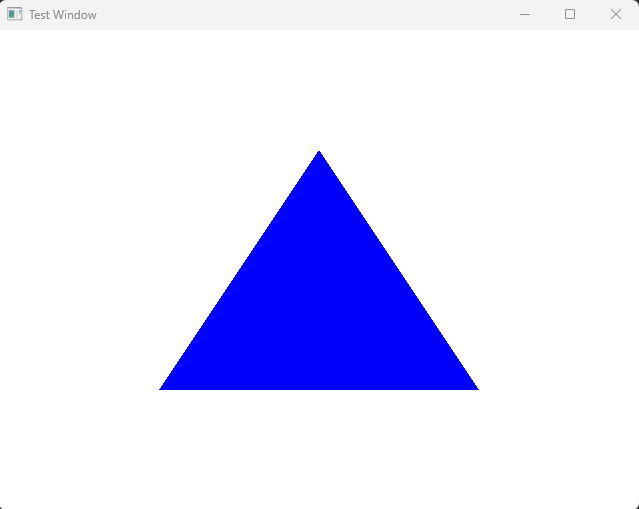

# GLFW  
 
## GLFW &amp; SOIL Playground
# Dependencies / Requirements
- `GLFW` = `OpenGL 3+`
- `GLEW` = `OpenGL 3+`
- `SOIL` = `OpenGL 3+`
- `GLSL 3.3+`
- GPU that supports `OpenGL 3+` i.e. NVIDIA GeForce 8 series+ or ATI Radeon HD 2000 series+
- GPU with `shader model 4.0+`

